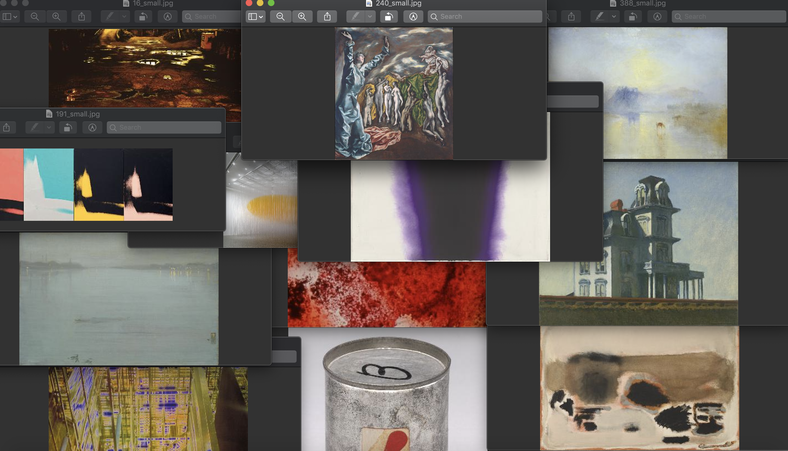
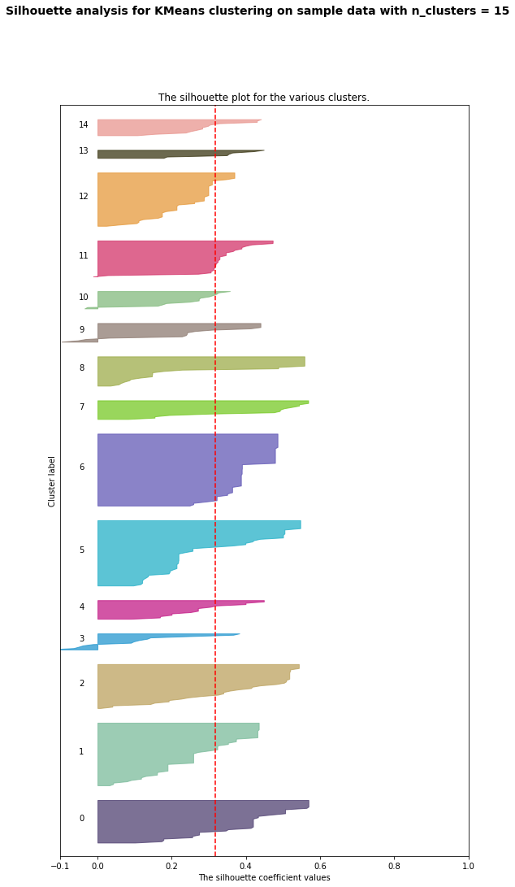

## Using unsupervised learning to cluster artworks based on selected characteristics
### Current model : K-Means

My first step in the clustering process was deciding on features for the model. The starter code offers us Bertin's six visual varibales, but I wanted to choose just a few of those and add others that needed some data transformation. When I was reading through the metadata of the feature options, I began to gravitate towards adding varibales related to space and planar qualities. My core features were "pl" (given location on the planar dimensions), "or" (various orientations, ranging from the vertical to the horizontal), and "ar" (signifying a range of measureable area size on a plane). I also added "co" (hue range), because why not! Looking through the metadata further, I saw a "spatial_dimension" and "spatial_dimension2" that I added to my features. Since the data was in boolean form, I did a quick find and replace in google sheets, transforming all false values to 0 and true to 1. This opened up some other feature options as well, but I only added one more feature: "reflection" which describes an artwork having some aspect of a reflective surface.

Once I decided on my features, I began to experiment with parameters in the K-means algorithm. After some time, I decided to stay with "init='random', n_init=200, max_iter=1000, tol=1e-10". I wasn't getting any major changes in my results, but I decided I liked some of the clusters coming from these choices. The inertia plot was showing an ideal cluster count (apex of the curve related to the X-axis) at around 5. This also had the highest average silhoutte score, but I wanted to cluster my artwork in more than five groups. I changed the cluster count outputs to see how the image selections and counts would change. Although it may not have been the "best" cluster choice, I liked what 15 clusters was creating with my parameters. I looked through images in a few of the clusters and was able to pick up some commonalities between each (and some randomness, which I liked). Please find in this folder the silhouette chart and a screenshot of one of my artwork clusters. 

